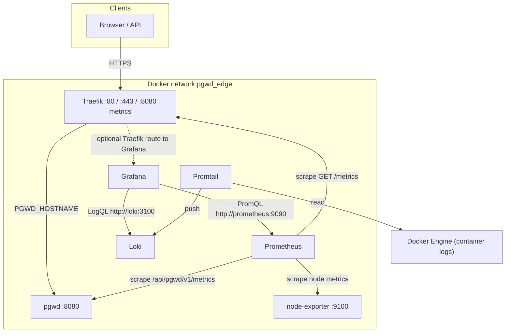

# Observability

← [Back to run/README](../../README.md) · [Compose index](../README.md).

**Shortcut:** [`run/scripts/compose-stack.sh`](../../scripts/compose-stack.sh) — e.g. **`./run/scripts/compose-stack.sh observability up -d`**, or **`./run/scripts/compose-stack.sh --traefik observability up -d`** when using the [Traefik overlay for Grafana](#grafana-behind-traefik-https-public-hostname).

This documentation lives in **[pgwd-selfhosted](https://github.com/hrodrig/pgwd-selfhosted)** under **`run/docker-compose/observability/`**. Command examples assume **`docker compose` is run from the repository root** unless noted otherwise.

### Where to put `.env.observability`

Do **not** keep the populated file inside this git clone. Use the **same host directory** as your main stack: **`${PGWD_HOST_DATA}`** must match the path you set in **`${PGWD_HOST_DATA}/.env`** (SQLite + main secrets).

1. **`export PGWD_HOST_DATA=/home/pgwd/pgwd-data`** (example — use your real path).
2. **`mkdir -p "$PGWD_HOST_DATA"`** if needed.
3. **`cp run/docker-compose/observability/observability.env.example "${PGWD_HOST_DATA}/.env.observability"`**
4. Edit **`"${PGWD_HOST_DATA}/.env.observability"`** (at minimum **`GRAFANA_ADMIN_PASSWORD`** before the first Grafana start).
5. Run **`docker compose`** from the **repository root** with **`--env-file "${PGWD_HOST_DATA}/.env.observability"`** on **every** invocation (`up`, `down`, `pull`, `ps`, `logs`, …). If **`PGWD_HOST_DATA`** is not in your shell, use the same literal path in each **`--env-file`** argument.

See comments at the top of **[`observability.env.example`](observability.env.example)** and root **[README.md](../../../README.md#persistent-data-and-secrets)**.

## What pgwd includes (built in)

| Included | Notes |
|----------|--------|
| **`GET /api/pgwd/v1/metrics`** | Prometheus text exposition for connection stats (when SQLite is configured and checks have run). See [Metrics reference](#metrics-reference) below. |
| **`GET /api/pgwd/v1/healthz`** | Plain health response when **`PGWD_HTTP_LISTEN`** is set (non-empty). |

There is **no** embedded Prometheus, Grafana, Loki, or dashboards in the container.

## What is optional (you install and operate)

| Component | Role |
|-----------|------|
| **Prometheus** | Scrapes `http->pgwd:8080/api/pgwd/v1/metrics` on an interval (see [`prometheus.yml`](observability/prometheus.yml)). |
| **Grafana** | Dashboards and alerts; reads Prometheus (metrics) and Loki (logs). |
| **Loki** | Log storage and querying. |
| **Promtail** | Ships Docker container logs to Loki. |
| **Node Exporter** | Exposes host CPU/memory/disk/network metrics (`node_*`) for dashboards such as [Grafana.com ID 1860](https://grafana.com/grafana/dashboards/1860). Scraped by Prometheus as `node-exporter:9100`. |
| **Traefik** (prod) | Prometheus-format metrics at **`http://traefik:8080/metrics`** on `pgwd_edge` (enabled in [`run/docker-compose/traefik/docker-compose.yml`](../../traefik/docker-compose.yml); port **8080** is not published on the host). Use for dashboards such as [Grafana.com ID 17346](https://grafana.com/grafana/dashboards/17346). |

Typical flow: **Prometheus** pulls metrics from pgwd, **Node Exporter**, and **Traefik** → **Grafana** graphs them. **Promtail** sends **Traefik** and **pgwd** container logs to **Loki** → Grafana **Explore** uses LogQL.

### Architecture overview

All services below attach to the same user-defined bridge **`pgwd_edge`** as [`run/docker-compose/traefik/docker-compose.yml`](../../traefik/docker-compose.yml) (Traefik + pgwd). The observability Compose project (`pgwd-obs`) adds Prometheus, Grafana, Loki, Promtail, and **Node Exporter**; **no extra Traefik container** is required. An optional second Compose file adds **labels** so the **existing** Traefik can route HTTPS to Grafana.



- **Solid arrows:** always-on paths for the prod app, scrapes of pgwd, Traefik (internal `:8080`), and Node Exporter, Grafana queries, Promtail → Loki.
- **Dotted arrow:** only when you apply **[`docker-compose.observability.traefik.yml`](docker-compose.observability.traefik.yml)** so Traefik exposes Grafana on a dedicated hostname (same TLS/Let’s Encrypt as pgwd).
- **Direct access:** you can still open Grafana on `localhost:GRAFANA_PORT` (or an SSH tunnel) without Traefik.

---

## Docker Compose stack (in this repository)

The repo ships an **optional** Compose file that runs Prometheus, Grafana, Loki, Promtail, and Node Exporter on the **same Docker network** as [`run/docker-compose/traefik/docker-compose.yml`](../../traefik/docker-compose.yml) (`pgwd_edge`). Prometheus scrapes **`pgwd:8080`**, **`traefik:8080/metrics`**, and **`node-exporter:9100`**. Traefik’s Prometheus exporter is defined in that **Traefik production Compose file** (not the observability stack).

Images are referenced by **`linux/amd64` manifest digest** (with the semver tag noted in comments) plus `platform: linux/amd64`, so deploys match a typical VPS and developers on **Apple Silicon** do not accidentally pull `arm64` images. To change or refresh pins, see **[observability-image-pins.md](observability-image-pins.md)**.

| File | Purpose |
|------|---------|
| [`docker-compose.observability.yml`](docker-compose.observability.yml) | Stack definition (project name `pgwd-obs`). |
| [`observability-image-pins.md`](observability-image-pins.md) | **Developer:** how to obtain `linux/amd64` digests and update pins when bumping images. |
| [`observability/prometheus.yml`](observability/prometheus.yml) | Scrape config: `pgwd:8080`, `traefik:8080`, `node-exporter:9100`. |
| [`observability/promtail-config.yaml`](observability/promtail-config.yaml) | Promtail Docker service discovery → Loki. |
| [`observability/grafana/provisioning/datasources/datasources.yml`](observability/grafana/provisioning/datasources/datasources.yml) | Grafana datasources (Prometheus + Loki). |
| [`observability.env.example`](observability.env.example) | Copy to **`${PGWD_HOST_DATA}/.env.observability`** (outside the repo); set secrets. |
| [`docker-compose.observability.traefik.yml`](docker-compose.observability.traefik.yml) | **Optional:** Traefik labels so Grafana is reachable at **`https://<GRAFANA_HOSTNAME>`** (same Traefik/Let’s Encrypt as prod). **Does not** change the Traefik production Compose file. |

### Grafana behind Traefik (HTTPS, public hostname)

The production stack already runs **Traefik** on `pgwd_edge` with Let’s Encrypt (`certresolver=le`). To put Grafana on a hostname such as `pgwd-obs.my-domain.com` **without editing** [`run/docker-compose/traefik/docker-compose.yml`](../../traefik/docker-compose.yml):

1. **DNS:** **`GRAFANA_HOSTNAME` must resolve to this host** (same public IP Traefik sees). **Both are valid:** **`A` / `AAAA`** records to the VPS address, **or** a **`CNAME`** to another hostname that already resolves here (e.g. `PGWD_HOSTNAME`). Choose whichever fits your DNS setup.
2. In **`${PGWD_HOST_DATA}/.env.observability`**, set `GRAFANA_HOSTNAME` and **`GRAFANA_ROOT_URL=https://…`** (e.g. `https://pgwd-obs.my-domain.com` — must match the URL users open in the browser; Grafana uses it for redirects and links).
3. **Start** the observability stack with **both** Compose files:

   ```bash
   docker compose --env-file "${PGWD_HOST_DATA}/.env.observability" -p pgwd-obs \
     -f run/docker-compose/observability/docker-compose.observability.yml \
     -f run/docker-compose/observability/docker-compose.observability.traefik.yml \
     up -d
   ```

Traefik picks up Grafana by Docker labels on the shared network; no new Traefik container is added. Optional: stop publishing `GRAFANA_PORT` on the host if you only want access via `https://` on port 443 (edit ports in the base file or use a local override).

**Whenever you redeploy the observability stack** (`up -d`, `pull` then `up`, image bumps, or any change that recreates Grafana), **pass both Compose files** if you use HTTPS via Traefik. Running `up -d` with only [`docker-compose.observability.yml`](docker-compose.observability.yml) recreates Grafana **without** Traefik labels, so routing on `https://<GRAFANA_HOSTNAME>` stops working until you run `up -d` again including [`docker-compose.observability.traefik.yml`](docker-compose.observability.traefik.yml). The same two-file pattern applies to `down`, `pull`, and `logs` when you want the labeled service definition.

### Prerequisites

1. **Start the production (Traefik) stack first** so the external network **`pgwd_edge`** exists — use the **same** **`PGWD_HOST_DATA`** and main env file as everywhere else:

   ```bash
   export PGWD_HOST_DATA=/home/pgwd/pgwd-data
   docker compose --env-file "${PGWD_HOST_DATA}/.env" -f run/docker-compose/traefik/docker-compose.yml up -d
   ```

2. **HTTP + metrics on pgwd:** the Compose files in this repo set **`PGWD_HTTP_LISTEN=0.0.0.0:8080`** and **`PGWD_SQLITE_PATH`** so `/api/pgwd/v1/metrics` can return data after successful checks. If you remove `PGWD_HTTP_LISTEN`, Prometheus has no scrape target.

3. **Observability env file** (same **`PGWD_HOST_DATA`** as step 1):

   ```bash
   mkdir -p "$PGWD_HOST_DATA"
   cp run/docker-compose/observability/observability.env.example "${PGWD_HOST_DATA}/.env.observability"
   # edit "${PGWD_HOST_DATA}/.env.observability" — set GRAFANA_ADMIN_PASSWORD (and optional ports / GF_SERVER_ROOT_URL)
   ```

### Start and stop (from repository root)

Use **`--env-file "${PGWD_HOST_DATA}/.env.observability"` on every** `docker compose` invocation (`up`, `down`, `ps`, `logs`, `pull`, …). Compose re-interpolates the YAML each time; without the env file, `GF_SECURITY_ADMIN_PASSWORD` substitution fails.

If Grafana is exposed via **[`docker-compose.observability.traefik.yml`](docker-compose.observability.traefik.yml)** (HTTPS on `GRAFANA_HOSTNAME`), use the **two-file** commands from [Grafana behind Traefik (HTTPS, public hostname)](#grafana-behind-traefik-https-public-hostname) for every `up`, `pull`, and `down` — not the single-file examples below (otherwise Grafana loses Traefik labels when recreated).

```bash
docker compose --env-file "${PGWD_HOST_DATA}/.env.observability" -p pgwd-obs -f run/docker-compose/observability/docker-compose.observability.yml up -d
```

```bash
docker compose --env-file "${PGWD_HOST_DATA}/.env.observability" -p pgwd-obs -f run/docker-compose/observability/docker-compose.observability.yml down
```

### Remove the observability stack completely (containers + volumes)

To stop the stack **and delete** the named volumes (`prometheus_data`, `grafana_data`, `loki_data`) — Prometheus TSDB, Grafana DB/dashboards, Loki chunks — use **`down -v`**:

```bash
docker compose --env-file "${PGWD_HOST_DATA}/.env.observability" -p pgwd-obs \
  -f run/docker-compose/observability/docker-compose.observability.yml \
  down -v
```

If you also use the Traefik overlay, pass the same extra file so Compose removes the labeled Grafana service too:

```bash
docker compose --env-file "${PGWD_HOST_DATA}/.env.observability" -p pgwd-obs \
  -f run/docker-compose/observability/docker-compose.observability.yml \
  -f run/docker-compose/observability/docker-compose.observability.traefik.yml \
  down -v
```

Verify no leftover volumes: `docker volume ls | grep pgwd-obs` (remove stragglers with `docker volume rm` if needed). This does **not** remove the `pgwd_edge` network or anything from [`run/docker-compose/traefik/docker-compose.yml`](../../traefik/docker-compose.yml).

Default URLs: **Grafana** `http://localhost:${GRAFANA_PORT:-3000}` · **Prometheus** `http://localhost:${PROMETHEUS_PORT:-9090}`. Pre-provisioned datasources point at `http://prometheus:9090` and `http://loki:3100` inside the stack.

### Grafana admin user and password (first boot only)

`GF_SECURITY_ADMIN_USER` and `GF_SECURITY_ADMIN_PASSWORD` in Compose are applied only when Grafana **initializes a new database** (typically the **first** time the `grafana` service runs with an **empty** `grafana_data` volume). After that, the admin password is stored in Grafana’s SQLite DB inside the volume.

- **Changing** `GRAFANA_ADMIN_PASSWORD` in `${PGWD_HOST_DATA}/.env.observability` later does **not** change the login: the old password remains valid until you change it inside Grafana or reset it.
- **To rotate the password:** use the Grafana UI (**Administration → Users**), or run `grafana-cli admin reset-admin-password …` inside the container, or remove the `grafana_data` volume and start again (wipes dashboards/preferences — only if acceptable).

### Validate the stack (without exposing it publicly)

You can confirm everything works **before** opening ports on the cloud firewall or enabling the Traefik overlay. Traffic stays on `127.0.0.1` on the VPS or inside an **SSH tunnel** to your laptop.

**1. On the VPS (SSH session)**

```bash
# Prometheus ready
curl -sS 'http://127.0.0.1:9090/-/healthy'

# Scrape target for pgwd (adjust PROMETHEUS_PORT if not 9090)
curl -sS 'http://127.0.0.1:9090/api/v1/targets' | head -c 1200

# Quick PromQL: job up
curl -sS --get 'http://127.0.0.1:9090/api/v1/query' --data-urlencode 'query=up{job="pgwd"}'

# Node Exporter (required for host dashboards such as Grafana.com ID 1860)
curl -sS --get 'http://127.0.0.1:9090/api/v1/query' --data-urlencode 'query=up{job="node-exporter"}'
curl -sS --get 'http://127.0.0.1:9090/api/v1/query' --data-urlencode 'query=count(node_uname_info)'

# Traefik (requires prod stack with metrics enabled on traefik:8080)
curl -sS --get 'http://127.0.0.1:9090/api/v1/query' --data-urlencode 'query=up{job="traefik"}'

# Grafana HTTP (expect 200 or 3xx)
curl -sS -o /dev/null -w '%{http_code}\n' "http://127.0.0.1:${GRAFANA_PORT:-3000}/login"

# Loki ready
curl -sS 'http://127.0.0.1:3100/ready'
```

If `pgwd` is **down** in Prometheus, check that the prod app is running, **`PGWD_HTTP_LISTEN`** is set, **`PGWD_SQLITE_PATH`** is writable, and both stacks share `pgwd_edge`.

### Node Exporter Full (Grafana.com ID 1860): empty Job / “No data”

That dashboard’s variables use **`node_uname_info`** (see upstream revision’s `label_values(node_uname_info, job)`). That metric exists only for scrapes of **Node Exporter**, not for `pgwd`. Seeing **`scrape_duration_seconds`** for `job="pgwd"` in Explore only proves Prometheus works for the app; it does **not** prove Node Exporter is scraped.

1. In Prometheus → **Status → Targets**, confirm **`node-exporter`** is **UP** (not only `pgwd`).
2. In Grafana **Explore** (Prometheus), run **`up{job="node-exporter"}`** — value should be **1**. Then run **`node_uname_info`** — you should see at least one series with `job="node-exporter"`.
3. If **`node-exporter` was started or fixed after Prometheus**, wait one scrape interval (~15s in [`observability/prometheus.yml`](observability/prometheus.yml)), then refresh the dashboard (or re-run the variable queries).

If the target is **DOWN**, check that the `node-exporter` container is running on `pgwd_edge` and that [`observability/prometheus.yml`](observability/prometheus.yml) still lists `node-exporter:9100` under `job_name: node-exporter`.

**2. SSH tunnel (use Grafana and Prometheus UIs from your laptop without public ports)**

From your **local** machine (adjust user and host):

```bash
ssh -N -L 9090:127.0.0.1:9090 -L 3000:127.0.0.1:3000 your-user@your-vps-hostname
```

Leave that terminal open. In a browser on the same machine:

- **Prometheus:** [http://127.0.0.1:9090](http://127.0.0.1:9090) → **Status → Targets** — **`pgwd`**, **`traefik`**, and **`node-exporter`** should be **UP** (after redeploying prod with Traefik metrics and reloading the Prometheus config).
- **Grafana:** [http://127.0.0.1:3000](http://127.0.0.1:3000) — sign in with `GRAFANA_ADMIN_USER` / `GRAFANA_ADMIN_PASSWORD`. Use **Explore** to query **Prometheus** (metrics) and **Loki** (logs). Data sources are provisioned from [`observability/grafana/provisioning`](observability/grafana/provisioning/datasources/datasources.yml).

If your local port `3000` or `9090` is already in use, map to other local ports, e.g. `-L 13000:127.0.0.1:3000` and open `http://127.0.0.1:13000`.

**3. Grafana “Error loading news”**

A small **Latest from the blog** panel may show an error if the server has **no outbound internet** to Grafana’s RSS feed. It does **not** affect metrics, logs, or data sources.

**4. Optional: keep host ports off the public internet**

Until you are ready, do not open `9090` / `3000` in the cloud security group, or use host firewall rules so only SSH (and later 80/443 for Traefik) are reachable.

### Promtail and Docker paths

Promtail mounts `/var/lib/docker/containers` and the Docker socket. That matches **Linux** Docker Engine. **Docker Desktop** (macOS/Windows) often uses different paths; Promtail may need [adjusted mounts](https://grafana.com/docs/loki/latest/send-data/promtail/installation/) or a different agent. If log shipping fails, metrics from Prometheus still work.

---

## Optional modifications to the Traefik production stack (not required by default)

Grafana-on-Traefik is handled by **[`docker-compose.observability.traefik.yml`](docker-compose.observability.traefik.yml)** (labels only). You **do not** need to change `run/docker-compose/traefik/docker-compose.yml` for HTTPS on `GRAFANA_HOSTNAME`.

| Goal | Change |
|------|--------|
| **Network missing** | If you run the observability stack **before** the prod stack once, `pgwd_edge` does not exist yet. **Fix:** start prod first, or create the network manually: `docker network create pgwd_edge` (then start prod so services attach correctly). |
| **Grafana public URL** | Use the **Traefik overlay** + DNS + `GRAFANA_ROOT_URL=https://…` (see above). No change to the Traefik **service** in prod — same container, new router from Grafana’s labels. |
| **Scrape Traefik / app** | Prometheus scrapes **`pgwd:8080`** and **`traefik:8080/metrics`** on `pgwd_edge` (internal; Traefik **8080** is not mapped to the host). You do **not** need a public Traefik route for `/metrics`. |
| **Lock UIs to localhost** | Optional: in **`run/docker-compose/observability/docker-compose.observability.yml`**, bind ports to `127.0.0.1` only, or drop `GRAFANA_PORT` when using only the Traefik URL. **Do not change** the Traefik production Compose file for this. |
| **Protect `/metrics` at Traefik** | Only if you expose pgwd on the internet in a way that exposes `/metrics`. Internal Prometheus scrape does **not** need a public `/metrics` route. |

---

## Metrics reference

- **URL (default in this chart / Compose):** `GET /api/pgwd/v1/metrics` (from `PGWD_HTTP_BASE_PATH` + `PGWD_HTTP_METRICS_PATH`).
- **Format:** Prometheus text exposition (`text/plain; version=0.0.4`).
- **Empty / comment responses:** If SQLite is not configured or no checks have been recorded yet, the handler may return explanatory comment lines only — that is normal until pgwd has run checks with a writable SQLite path.

### Exported metrics (summary)

Labels typically include **`client`**, **`cluster`**, **`database`** (see upstream [pgwd](https://github.com/hrodrig/pgwd) HTTP server).

| Metric | Meaning |
|--------|---------|
| `pgwd_connections_total` | Total connections reported for the DB. |
| `pgwd_connections_active` | Active connections. |
| `pgwd_connections_idle` | Idle connections. |
| `pgwd_connections_stale` | Stale connections (per pgwd stale rules). |
| `pgwd_max_connections` | Server `max_connections` (or test override). |
| `pgwd_state` | Discrete state (`ok`, `attention`, `alert`, etc.) encoded as numeric series. |

### Example: Grafana Explore (Prometheus)

With Prometheus scraping **`pgwd`** and Grafana’s **Explore** tab using the provisioned Prometheus data source, you should see **`pgwd_*`** metrics after pgwd has completed at least one check with SQLite enabled. (No screenshots in-repo; capture locally from Explore if you need visuals for your runbook.)

Example query — total connections by database:

```promql
pgwd_connections_total
```

**How to read it:** each series is keyed by `client`, `cluster`, and `database`. Use **`pgwd_state`** for alerting on threshold state.

### Security (metrics)

Treat **`/api/pgwd/v1/metrics`** like any internal operational endpoint: scrape on **`pgwd_edge`**, avoid publishing it on the public internet without auth, or protect it at Traefik if you expose the hostname widely.

---

## Manual installation (without this repo’s Compose)

You can run Prometheus, Grafana, and Loki using upstream guides only. The same scrape target applies: `pgwd:8080` on a shared Docker network, or `host:port` when appropriate. See:

- [Prometheus configuration](https://prometheus.io/docs/prometheus/latest/configuration/configuration/)
- [Grafana: Prometheus data source](https://grafana.com/docs/grafana/latest/datasources/prometheus/)
- [Grafana Loki: getting started](https://grafana.com/docs/loki/latest/get-started/)
- [Promtail](https://grafana.com/docs/loki/latest/send-data/promtail/)

---

**[↑ Back to run/README](../../README.md)**
